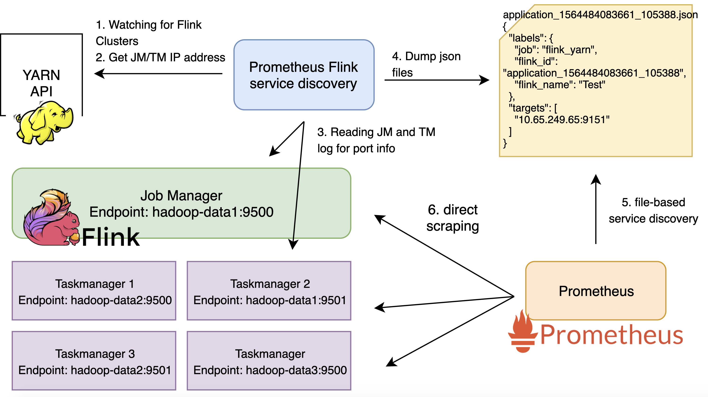

Prometheus Flink Service Discovery
===================================

Introduction
---------------

A simple service for discovering Flink cluster on Hadoop Yarn.

Credit to original idea here: https://github.com/eastcirclek/flink-service-discovery

**flink-prometheus-sd** communicates with YARN ResourceManager and Flink JobManager via REST APIs, and communicates with Prometheus via its file-based service discovery mechanism.



Getting Started
---------------

Build from source

```bash
env GOOS=linux GOARCH=amd64 go build -o ./bin/prometheus_flink_sd ./
```

Usage

```bash
go run prometheus_flink_sd

  -address string
        Provided yarn resource manager address for service discovery mode
  -app-id string
        If specified, this program runs once for the application. Otherwise, it runs as a service.
  -debug
        Enable debug mode
  -folder string
        Provided target folder for writing json targets
  -log-file string
        Provided log file path
  -poll-interval int
        Polling interval to YARN in seconds. (default 30)
  -timeout int
        HTTP query timeout in seconds. (default 15)
```

### One app mode

Run in **one app mode** will get data of one flink cluster and stop

```bash
./prometheus_flink_sd \
    -address yarnapi.test.com:8088 \
    -folder /home/duy_nguyen/flink-prometheus-sd/test/ \
    -app-id application_1564484083661_84632
```

### Service mode

Run in **service mode** will get data of all running flink clusters and keep checking for update every 30 seconds

```bash
./prometheus_flink_sd \
    -address yarnapi.test.com:8088 \
    -poll-interval 30 \
    -timeout 20 \
    -folder /home/duy_nguyen/flink-prometheus-sd/targets/ \
    -log-file /home/duy_nguyen/flink-prometheus-sd/mylog
```

Result

`cat application_1564484083661_105388.json`

```json
[
{
  "labels": {
    "job": "flink_yarn",
    "flink_id": "application_1564484083661_105388",
    "flink_name": "Test"
  },
  "targets": [
    "10.65.249.65:9151"
  ]
}
]
```

`cat application_1564484083661_98040.json`

```json
[
{
  "labels": {
    "job": "flink_yarn",
    "flink_id": "application_1564484083661_98040",
    "flink_name": "Test Prometheus"
  },
  "targets": [
    "10.65.232.5:9150",
    "10.65.232.22:9150",
    "10.65.249.65:9150",
    "10.65.232.144:9150",
    "10.65.249.23:9150"
  ]
}
]
```

Automatically update when new apps are deployed or removed

```text
2019/10/19 16:04:59 ---- Update status ----
2019/10/19 16:04:59 Running apps:  27
2019/10/19 16:04:59 New apps:  0
2019/10/19 16:04:59 Removed apps:  1
2019/10/19 16:04:59 AppID: application_1564484083661_118393 - File /etc/prometheus/prometheus_flink_sd/targets/application_1564484083661_118393.json deleted
2019/10/19 18:00:29 ---- Update status ----
2019/10/19 18:00:29 Running apps:  28
2019/10/19 18:00:29 New apps:  1
2019/10/19 18:00:29 Removed apps:  0
2019/10/19 18:00:29 App ID: application_1564484083661_118474 - Write file successfully
2019/10/19 18:01:59 ---- Update status ----
2019/10/19 18:01:59 Running apps:  28
2019/10/19 18:01:59 New apps:  1
2019/10/19 18:01:59 Removed apps:  1
2019/10/19 18:01:59 AppID: application_1564484083661_118474 - File /etc/prometheus/prometheus_flink_sd/targets/application_1564484083661_118474.json deleted
2019/10/19 18:01:59 App ID: application_1564484083661_118479 - Write file successfully
```

Guideline
------------

How to do this manually:

1. Watch a new Flink cluster
2. Get the address of JobManager (JM)
   1. Get JM IP address from the config
   2. Get JM port from log
3. Get the list of all TaskManager (TM) endpoints
   1. Get TM IP
   2. Get TM port from log
4. Dump both JM and TM endpoints to json and let Prometheus to scrape from it
